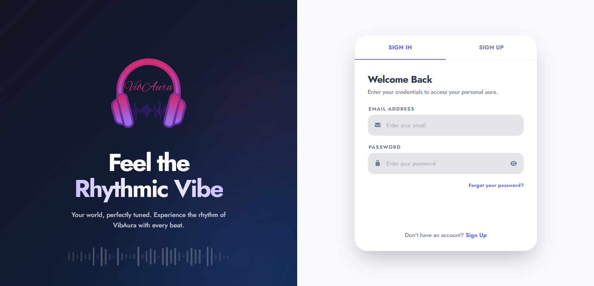
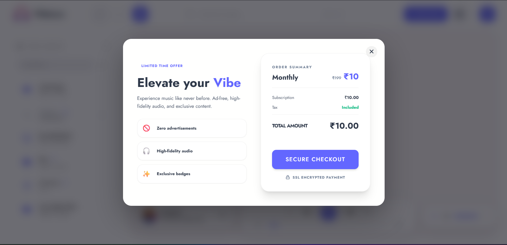
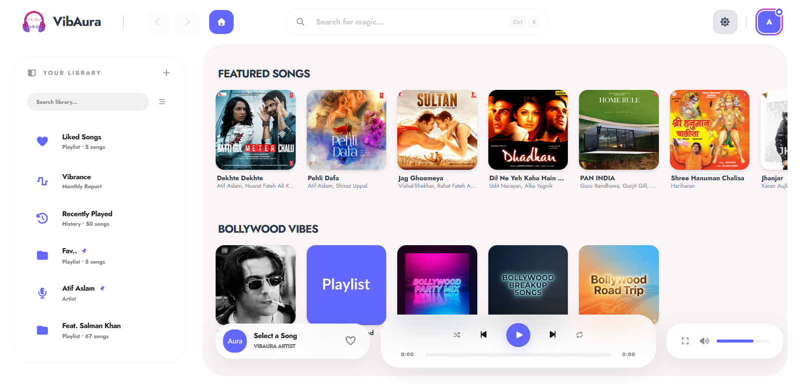
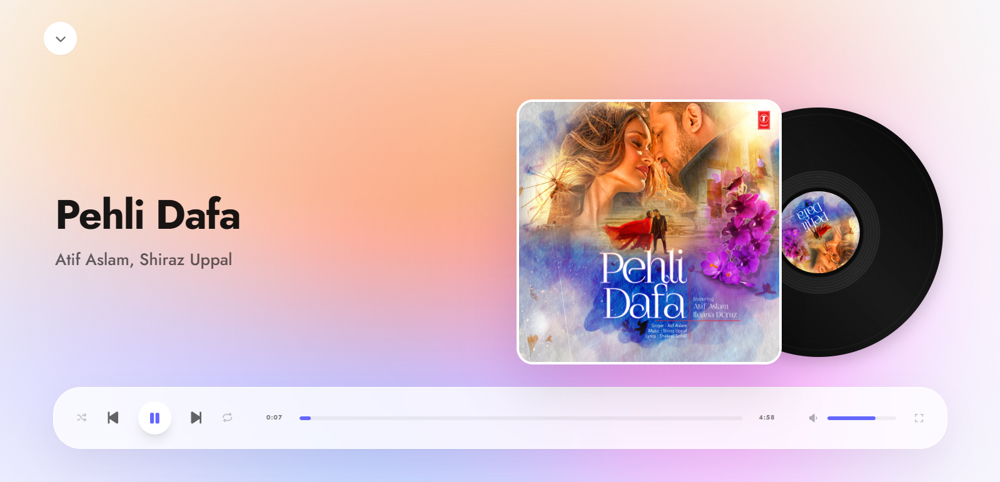

<div align="center">


# VibAura — Rhythmic Vibe
**A Premium, High-Fidelity Music Experience**

[](https://github.com/iakashy05/VibAura)
[](#)
[](#)

VibAura is a modern music streaming platform designed with a "Rhythmic Vibe" aesthetic. It combines high-fidelity audio delivery with a premium subscription model and an immersive, glowing UI.

</div>

---

## ✨ Experience the Vibe

### ⚡ Premium "Pro Vibe" System
Elevate your listening experience with our tiered subscription model:
- **Razorpay Integration**: Secure, seamless payment flow with instant verification.
- **Exclusive Badges**: Pro members get a unique gradient-glow avatar ring and a dedicated PRO VIBE badge.
- **Feature Gating**: Exclusive access to the Fullscreen Player, Monthly Wrapped (Vibrance), and unlimited playlists.

### 🎨 Iconic Design Language
- **Rhythmic Auth**: A 50/50 split authentication page featuring a dynamic glowing gradient and a real-time Music Wave visualizer.
- **Premium Aesthetics**: Heavy use of backdrop blurs, glassmorphism, and 3D zoom animations for a high-end feel.
- **Adaptive UI**: Perfectly consistent "Pod" layout across all content views.

### 🎵 Core Musicality
- **High-Fidelity Audio**: Optimized streaming for crystal-clear sound.
- **Smart Discovery**: AI-curated discovery sections and real-time search.
- **Universal Connection**: Built-in DNS optimization to ensure the project connects to the database on any network or ISP.

---

## 📸 Screenshots

<div align="center">
  <table>
    <tr>
      <td width="50%">
        <p align="center"><b>Authentication Page</b></p>
        
      </td>
      <td width="50%">
        <p align="center"><b>Pro Vibe Modal</b></p>
        
      </td>
    </tr>
    <tr>
      <td width="50%">
        <p align="center"><b>Main Dashboard</b></p>
        
      </td>
      <td width="50%">
        <p align="center"><b>Fullscreen Player</b></p>
        
      </td>
    </tr>
  </table>
</div>

---

## 🛠️ Tech Stack

- **Frontend**: [React](https://reactjs.org/) + [Vite](https://vitejs.dev/) + [Tailwind CSS](https://tailwindcss.com/)
- **State Management**: [Zustand](https://github.com/pmndrs/zustand)
- **Backend**: [Node.js](https://nodejs.org/) + [Express.js](https://expressjs.com/)
- **Database**: [MongoDB](https://www.mongodb.com/) via [Mongoose](https://mongoosejs.com/)
- **Payments**: [Razorpay](https://razorpay.com/)
- **Architecture**: npm Workspaces (Monorepo)

---

## 🚀 Getting Started

### Prerequisites
- Node.js (v18+)
- MongoDB Atlas account
- Razorpay API Keys

### 1. Installation
The project uses **npm Workspaces**, so you only need to run install once at the root:
```bash
git clone https://github.com/iakashy05/VibAura.git
cd VibAura
npm install
```

### 2. Environment Setup
Create a `.env` file inside the `server/` directory based on the `.env.example`:
```env
DB_URI=your_mongodb_uri
JWT_SECRET=your_secret_key
RAZORPAY_KEY_ID=your_key_id
RAZORPAY_KEY_SECRET=your_key_secret
```

### 3. Running the App
Start both the client and server with a single command from the root:
```bash
npm run dev
```

---

## 📁 Project Structure

```text
VibAura/
├── client/             # Vite + React Frontend
│   ├── src/            # Components, Hooks, Store, Services
│   └── public/         # Static assets & Screenshots
├── server/             # Node.js + Express Backend
│   ├── src/            # Controllers, Models, Routes, Config
│   └── .env.example    # Backend environment template
├── package.json        # Root workspace configuration
└── README.md           # You are here!
```

---

## 👤 Author
**Akash Yadav** — [@iakashy05](https://github.com/iakashy05)

<div align="center">
  <h3>Made with ❤️ by Akash Yadav</h3>
</div>
