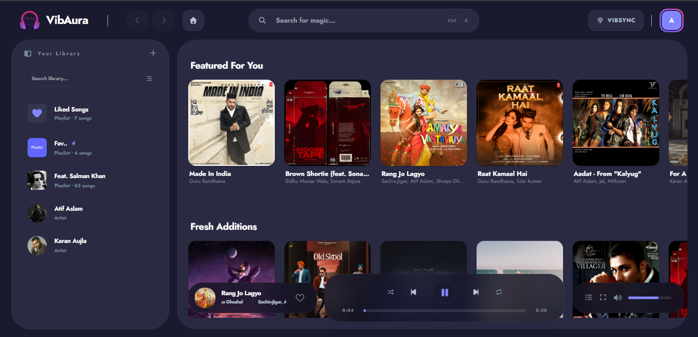
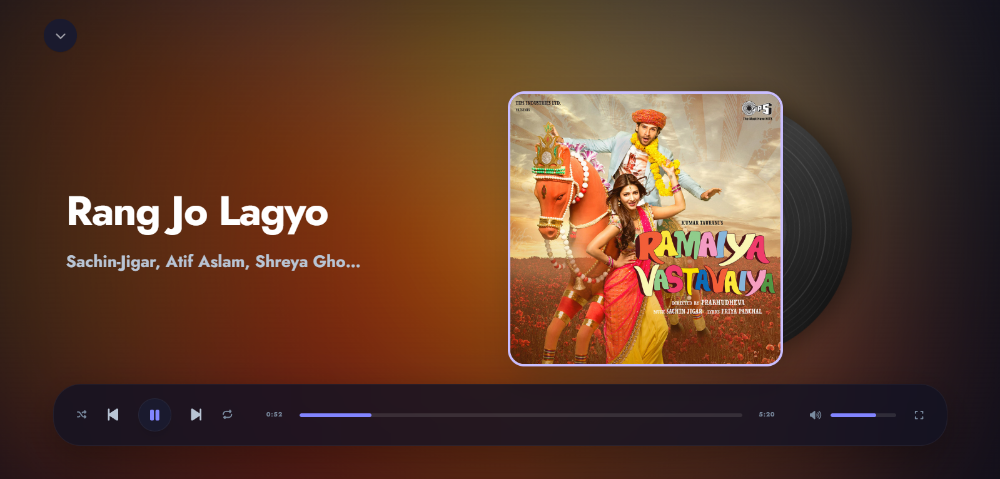
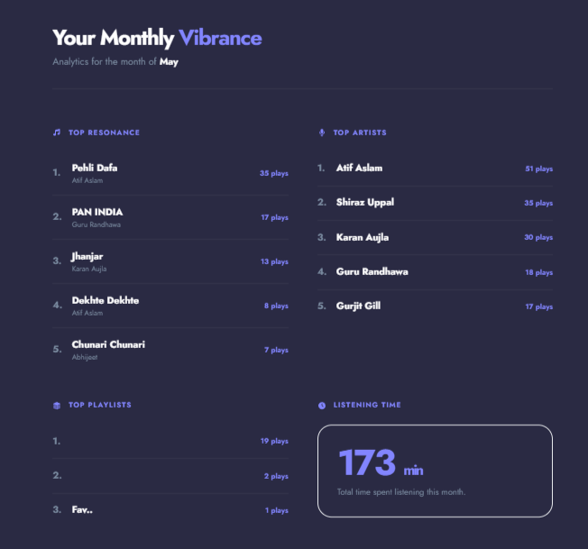
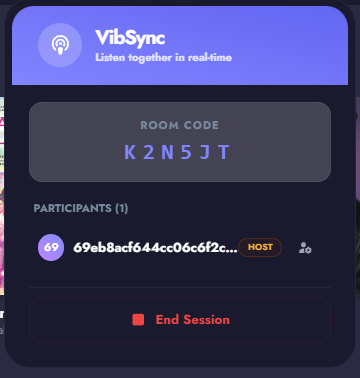
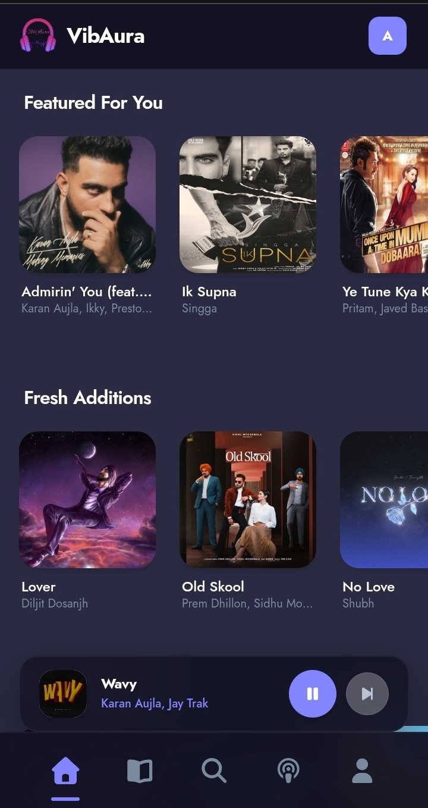
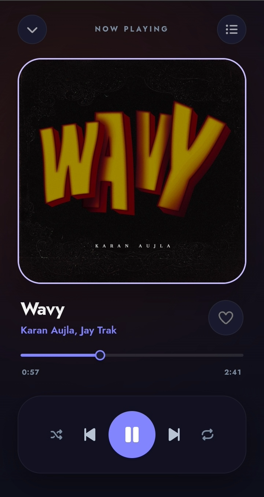
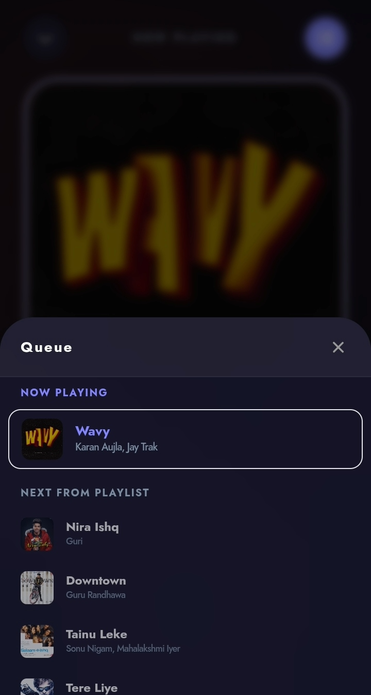

<div align="center">


# 🌌 VibAura — Rhythmic Vibe
### **A Premium, High-Fidelity Audio Experience & Shared Listening Space**

VibAura is a state-of-the-art, high-fidelity music streaming and real-time synchronized listening platform. Built for audio purists and digital socializers alike, VibAura combines rich immersive aesthetics, advanced auditory statistics, secure billing systems, and low-latency websocket connectivity inside a sleek unified design system.

[](https://github.com/iakashy05/VibAura)
[](#)
[](#)
[](#)

</div>

---

## 📸 Premium Visual Showcase

Explore the premium glassmorphic interface and design details of VibAura:

<div align="center">
  <table>
    <tr>
      <td width="50%">
        <p align="center"><b>⚡ Rhythmic Split Authentication</b></p>
        
        <p align="center"><small>Interactive login/signup panel featuring dynamic organic glowing gradients and a real-time reactive Audio Waveform Visualizer.</small></p>
      </td>
      <td width="50%">
        <p align="center"><b>🎨 Unified Dashboard (Dark Mode)</b></p>
        
        <p align="center"><small>The balanced Pod Layout with synchronized library views, border-highlight-only search inputs, and pure white high-contrast elements.</small></p>
      </td>
    </tr>
    <tr>
      <td width="50%">
        <p align="center"><b>🎵 Desktop Fullscreen Player</b></p>
        
        <p align="center"><small>Dynamic cover artwork album-matched glow backdrop, combined with an asymmetric sliding vinyl disc featuring smooth, hardware-accelerated rotational physics.</small></p>
      </td>
      <td width="50%">
        <p align="center"><b>👑 Pro Vibe & Razorpay Gateway</b></p>
        
        <p align="center"><small>A secure glassmorphic subscription checkout panel powered by Razorpay API, granting avatar status and exclusive system features.</small></p>
      </td>
    </tr>
    <tr>
      <td width="50%">
        <p align="center"><b>📊 Vibrance Wrapped (Analytics)</b></p>
        
        <p align="center"><small>A premium statistical dashboard analyzing monthly frequencies, auditory ranges, top genres, and user listening characteristics.</small></p>
      </td>
      <td width="50%">
        <p align="center"><b>🎧 VibSync Live Session</b></p>
        
        <p align="center"><small>Real-time websocket-powered listening room enabling multi-user track synchronization, active listener avatars, and live session chats.</small></p>
      </td>
    </tr>
  </table>
</div>

### 📱 Premium Mobile Native Experience

For a truly portable, high-fidelity auditory journey, VibAura boasts a fully optimized, touch-first mobile layout with native-feeling sheet sliders, floating controllers, and fluid drawer animations:

<div align="center">
  <table>
    <tr>
      <td width="33%">
        <p align="center"><b>🎨 Dashboard & Miniplayer</b></p>
        
        <p align="center"><small>Floating glassmorphic player pill sitting elegantly above a highly responsive, touch-friendly tabbed bottom navigation bar.</small></p>
      </td>
      <td width="33%">
        <p align="center"><b>🎵 Full-Bleed Player</b></p>
        
        <p align="center"><small>Full-bleed dynamic aura gradient background matched to the album art, featuring custom seeking thumbs and active heart particle animations.</small></p>
      </td>
      <td width="33%">
        <p align="center"><b>⚙️ Drawer & Queue Sheet</b></p>
        
        <p align="center"><small>Snappy slide-out Profile Settings Drawer and bottom-anchored slide-up active playback Queue sheets designed for one-handed controls.</small></p>
      </td>
    </tr>
  </table>
</div>

---

## ✨ Immersive Core Features

### 🎧 VibSync — Shared Listening Rooms
Synchronize your rhythm. VibSync allows premium users to launch private listening rooms that stream audio in perfect lock-step across multiple distant browsers using real-time **Websockets**.
* **Precise Time Sync:** Keeps tracks playing within milliseconds of accuracy.
* **Dynamic Presenter Gating:** Controls who handles play/pause, seeks, and queue ordering.
* **Live Session Feedback:** Displays active listeners' custom styled avatars and live synchronization status.

### 👑 Premium "Pro Vibe" Tiers & Secure Billing
A gorgeous, fully gated subscription ecosystem that validates payments cleanly and provides immediate rewards.
* **Razorpay Payment Integration:** Custom visual checkout panels processing payments securely with real-time webhooks.
* **Pro Badge & Glow Avatar:** Unlocks custom gradient avatar borders and exclusive badges.
* **Exclusive Access Gates:** Restricts the Fullscreen Asymmetric Player, unlimited playlist curation, and monthly **Vibrance** analytics to premium members.

### 🎨 Iconic Glassmorphic Aesthetic
* **Unified Pod Architecture:** A mathematically balanced card system that aligns sidebars, header navigation controls, search inputs, and dashboards on desktop and mobile.
* **Theme-Synchronized Controls:** Responsive back, forward, home, and unconnected VibSync buttons that adapt perfectly.
* **Optimal Dark Mode Parity:** Highly legible, pure white text, placeholder cues, and keyboard shortcuts (`Ctrl + K`) over custom indigo elements.

### 💿 Continuous Vinyl Physics Player
An asymmetric visual masterpiece built for the desktop experience:
* **Nested DOM Translation:** Decoupled lateral slide-out mechanics (`left-1/2` to `left-[78%]`) from spin rotations to prevent visual clashing.
* **Realistic Vinyl Details:** Rendered with visible concentric grooves (grooves closer at different scales), custom track separators, diagonal reflection sweeps, and a shiny silver metallic spindle border around the rotating cover art label.
* **Fluid animationPlayState:** Uses `animation-play-state: running/paused` to dynamically freeze the record when paused, resuming seamlessly right from the exact degree it stopped at without resetting.

---

## 🛠️ Architecture & Tech Stack

VibAura is built as an ultra-responsive, scalable monorepo leveraging the following technical components:

```text
               ┌──────────────────────────────┐
               │    VibAura npm Workspace     │
               └──────────────┬───────────────┘
                              │
              ┌───────────────┴───────────────┐
              ▼                               ▼
    ┌──────────────────┐            ┌──────────────────┐
    │  client/ (Vite)  │            │  server/ (Node)  │
    └─────────┬────────┘            └─────────┬────────┘
              │                               │
    ┌─────────┼─────────┐                     │
    ▼         ▼         ▼                     ▼
 ┌─────┐   ┌─────┐   ┌─────┐            ┌───────────┐
 │React│   │Zust │   │Tail │            │Express/WS │
 └─────┘   └─────┘   └─────┘            └─────┬─────┘
                                              │
                                              ▼
                                        ┌───────────┐
                                        │  MongoDB  │
                                        └───────────┘
```

* **Frontend Framework:** React 19.x with Vite 8.x for instant hot-reloading and micro-second bundling pipelines.
* **Styling Engine:** Custom HSL variables layered into Tailwind CSS, delivering dynamic light/dark modes with zero content flashing.
* **State Shell:** Zustand (Centralized stores managing playback queues, websocket connections, authentications, and interface settings).
* **Audio Layer:** Fused custom React hooks wrapping the HTML5 `Audio` node, ensuring strict synchronization between store states and web audio codecs.
* **Backend Runtime:** Node.js with Express, deploying a modular MVC architecture (Controllers, Routes, Models, and Middlewares).
* **Database Platform:** MongoDB Atlas using Mongoose schemas for highly structured schema-less document mappings.
* **Low-Latency Sockets:** Socket.io client/server configurations, processing multi-user synchronization events securely in real-time.
* **Monorepo Strategy:** Managed via `npm workspaces` (independent client and server folders run under a single root project root directory).

---

## 🚀 Installation & Local Launch

### Prerequisites
* **Node.js** (v18.x or higher)
* **MongoDB** (Local instance or MongoDB Atlas Connection String)
* **Razorpay Developer API Keys** (Generated from Razorpay dashboard)

### 1. Project Setup
VibAura utilizes **npm workspaces**, which means you install dependencies for all client and server packages in a single run at the project root:
```bash
# Clone the repository
git clone https://github.com/iakashy05/VibAura.git

# Navigate to root directory
cd VibAura

# Single-command workspace install
npm install
```

### 2. Environment Variables Configuration
Create a `.env` file in the `/server` directory and fill in your keys:
```env
# MongoDB Atlas or Local connection string
DB_URI=mongodb+srv://<username>:<password>@cluster.mongodb.net/vibaura?retryWrites=true&w=majority

# Secret key for JWT Token generation
JWT_SECRET=your_jwt_secret_token_key_here

# Razorpay API Credentials (from test dashboard)
RAZORPAY_KEY_ID=rzp_test_xxxxxxxxxxxxxx
RAZORPAY_KEY_SECRET=xxxxxxxxxxxxxxxxxxxxxxxx
```

### 3. Development Server Bootup
Start both the client (Vite frontend) and server (Node backend) simultaneously using a single, concurrent command from the root folder:
```bash
# Start concurrently
npm run dev
```
* The **Vite Client** will spin up at `http://localhost:5173`
* The **Express Backend** will host at `http://localhost:5000`

---

## 📁 Repository Directory Structure

```text
VibAura/
├── client/                     # Vite + React Frontend Shell
│   ├── public/                 # Static assets, logos, and screenshots
│   └── src/
│       ├── components/         # Shared React UI components
│       │   ├── auth/           # Login, Register, Forgot Password components
│       │   ├── layout/         # Header, Sidebar, Fullscreen Players, Miniplayers
│       │   └── ui/             # Context menus, custom inputs, toast widgets
│       ├── hooks/              # Audio hooks, WebSocket sync hooks
│       ├── pages/              # Library, Playlists, Artist profiles, Wrapped Reports
│       ├── services/           # Axios HTTP request clients
│       └── store/              # Zustand centralized state stores
├── server/                     # Node.js + Express Backend Shell
│   └── src/
│       ├── config/             # Database connection, Razorpay, and Socket setups
│       ├── controllers/        # Audio tracks, playlist structures, payment controllers
│       ├── models/             # User profiles, payments, listening history schemas
│       ├── routes/             # Exposed secure REST API endpoints
│       └── services/           # Discovery recommendation engines
├── package.json                # npm workspaces root config definition
└── README.md                   # Project documentation shell
```

---

## 👤 Project Maintainer
**Akash Yadav** — [@iakashy05](https://github.com/iakashy05)

<div align="center">
  <h3>Made with ❤️ by Akash Yadav</h3>
</div>
